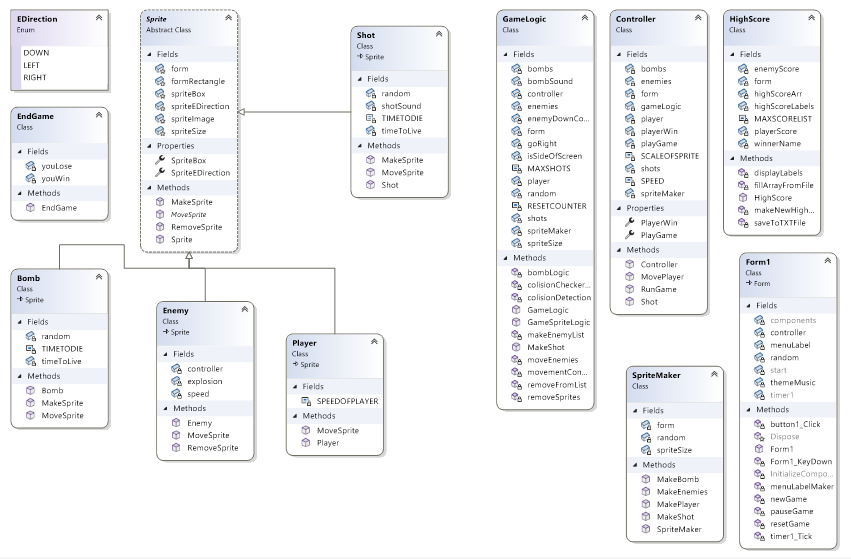

Sprites are downloaded form https://www.pngegg.com/en/search?q=space+Invaders
Music from https://downloads.khinsider.com/game-soundtracks/album/contra-1988-nes
Shot and bomb are from the resources provided.

Controls.Add, Controls.Remove and Controls.Clear I found by typing stuff in on VS and I had a guess at how and what it did.
Then I looked it up on the Microsoft Docs https://learn.microsoft.com/en-us/dotnet/csharp/

No double buffering has been used in this as the Graphics class hasn't been used in this project, unlike the other one that was completely Graphics.
Only PictureBoxs were used with a few labels.
Also the Forms backgroundImage is used to display the winner or loser, I just came across this by trying stuff out without looking up how to do it.

Bugs:
The screen can flash a bit when pressing the R button to reset the game, if pressed repeatedly.
If you resize the form window the sprites wont resize with them, you will have to press R for the game to resize.

Features:
The game maximizes on open and the sprites are a relitive size so they will fit any size of screen.

Product of Nigel Maynard.
Github legin8